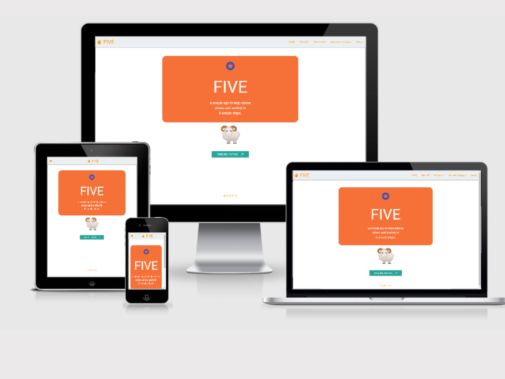
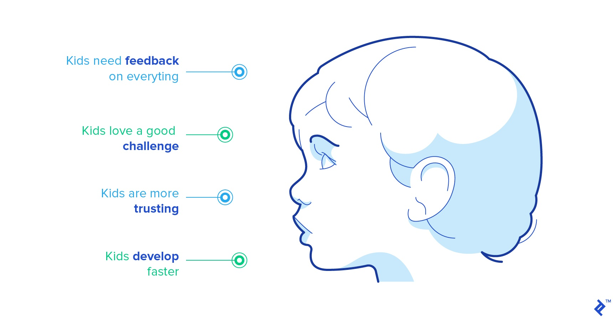
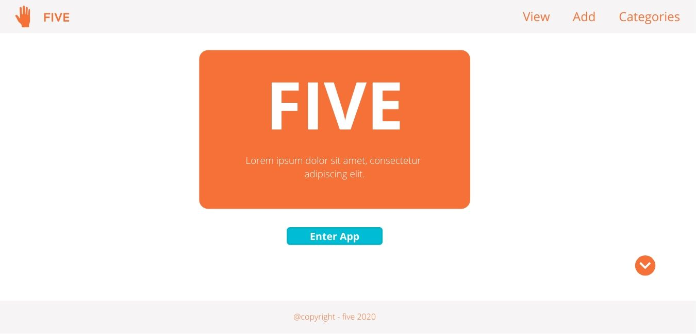
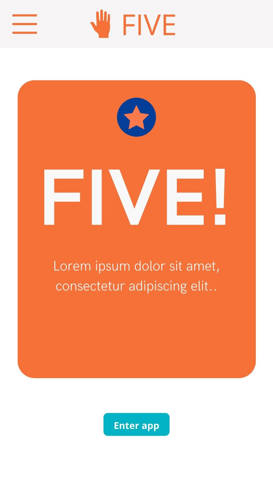
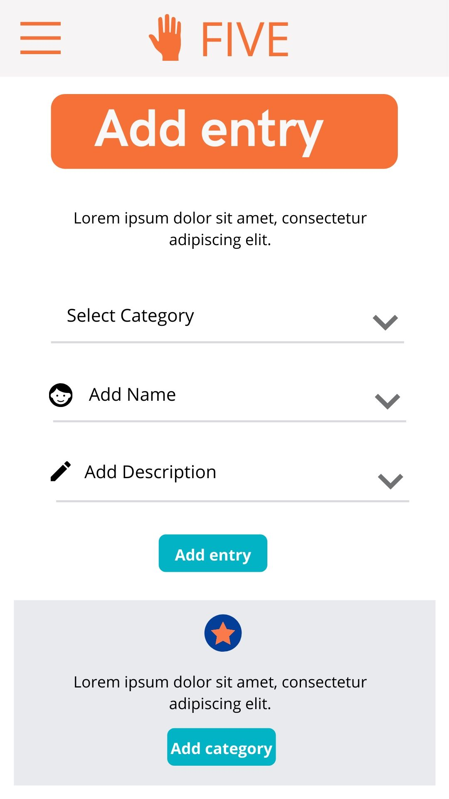
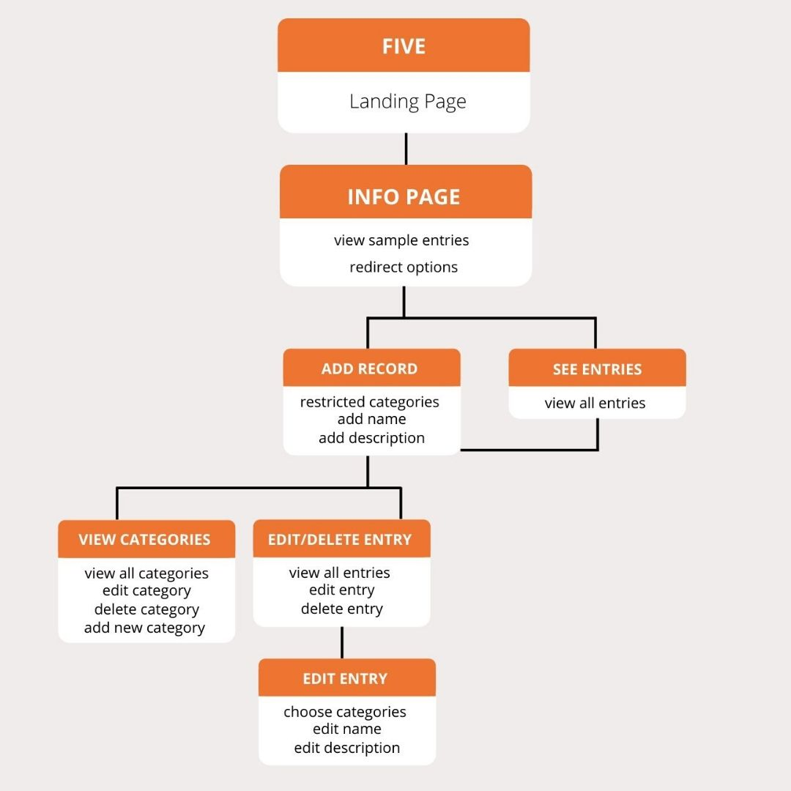

# FIVE


‘FIVE’ is a wellness website/app focused on children and young teens that suffer from anxiety and stress. A much simpler format than current wellness apps, with the focus on the users own self-prescribed forms of ‘mindfulness’. Too many apps come with pre-prescribed ‘meditation’ routines that are an adults idea of what would be good for young teens, rather than creating an app that teens can use and edit themselves to suit their own personal needs.
The principles behind the design are based on a simple ‘task manager app’, the user can input, edit, delete and personalise mindfulness routines that work. The inspiration for FIVE came from the 5 steps of a simple yet effective grounding exercise. Seeing many routies come in ‘5’ steps, 5 breaths, etc, I created FIVE as a simple app for young teens.
The site was built using Gitpod, Github and Heroku. 

You can see the deployed Heroku site here: <a href="https://five-5.herokuapp.com/" target="_blank">five-5.herokuapp.com</a>



------

## Table of Contents:
1. [Project outline](#project-outline)
2. [User Experience](#user-experience)
3. [Design](#design)
4. [Features](#features)
5. [Technologies](#technologies)
6. [Testing](#testing) 
7. [Deployment](#deployment)
8. [Future Development](#future-development)
9. [Credits](#credits)
10. [Acknowledgements](#Acknowledgements)

***

## Project Outline
This website/app deploys all my course learning to date with the Code Institute. The elements I used in creating this website, are all practical techniques I have been learning, working through the Data Centric modules of the Full Stack Developer Bootcamp.

***

## User Experience

### Research:
I carried out some research on creating apps for children and teens, and found lots of great websites and articles, (links and further reading below).
 - https://www.toptal.com/designers/interactive/guide-to-apps-for-children
 - https://www.invisionapp.com/inside-design/building-apps-for-children/
 - https://www.uxmatters.com/mt/archives/2014/07/design-for-kids-digital-products-for-playing-and-learning.php

 
 (graphic from toptal article, link above)

 Learning outcomes include using clean design with bright colours, simplicity. Obvious consistency across the design, a reason to use the app, let them be able to make mistakes, and easily fix them. A learning process through using the app.

### User Stories:
The app is a simple mindfulness app, that focuses more on storing information, then giving information. Children that suffer from anxiety are regularly taught exercises in grounding, and breathing, to help calm them down. By the time they get to be young teens, they have not just forgotten the steps of these exercises, they don’t want to do silly ‘children’s exercises’, and they certainly don’t want to listen to an adult, in particular their parents nagging them about remembering to do their grounding exercises. This app is for them. 

_For the Generic User:_

I designed this app with a particular type of user in mind. A young teen, who suffers from anxiety.  They are old enough to have a mobile phone and are fairly tech savvy, particularly when it comes to apps. They are old enough to almost hate their parents, and not want to listen to them, or any other adult talk about anxiety. They could have suffered from anxiety for years, or are newly anxious, they have been taught grounding and breathing exercises and are sick to death of adults talking about ‘mindfulness’. However much they hate ‘mindfulness’, they know it can work, however, in the heat of the moment, they tend to forget the exercises, and hate feeling vulnerable and asking for help. (Just like adults, this app can be used by adults too.)

Potential use of the app:
 - Use the calming grounding and breathing exercises to help soothe anxious feelings
 - Personalize the app, using it as a safe place to store mindfulness exercises that they know work
 - Use the app to store random lists of things they find funny, that make them smile.The very act of getting the phone out, and using the app, could be a first step in helping relieve the anxiety.

Practical use of the app. The user:
- Can read and use the exercises already submitted
- Can edit the existing categories and add/or delete new personalized ones
- Can edit existing exercises and and add/or delete new  personalized ones
 
_For the Developer:_

As a developer, I wanted to create a fully responsive app, following MVP principles (minimum viable product), using CRUD operations manipulate data, to get, post and store information from a database
 - This website would help me practice my new coding skills, develop logic and understanding of data centric application.
 - Development of coding skills using programming languages, frameworks and databases, to ways to create a website that is simple, extremely user friendly, with easy navigation, and yet capable of being a useful function website. To misquote the king of design himself, William Morris

```
“Have nothing in your phone that you do not know to be useful, or believe to be beautiful.”
```
 - The design for this website/app was mobile first. It was designed to be a phone application, while still functioning on larger screens.

 [Back to Top](#table-of-contents)


----

## Design

#### Strategy & Scope:
The website is designed to have a minimal and clean interface, using bright clean colours. A landing welcome page, with a series of linked pages for the different actions which include retrieving, iterating, editing, adding and deleting information.

_Style:_
 - Design - minimalist, clean design
 - Fonts - I used Google Fonts to personalize the text. 
 - Color Scheme - The color scheme is simple, and kept to a minimum to ensure full eligibility. 


_Structure, Skeleton & Surface:_
Keeping the pyramid of interface success, 'user - utility- usability',  from my last project, and my user story in mind, simplicity and ease of use were the most important design elements, when creating the wireframe and mock up. Keeping images to a minimum, with simple explanations of how to use the site, with a very deliberate colour scheme and simple fonts. 

_Wireframing:_

I created a wireframe for this website using Balsamiq
[thumbnail image of wireframe]
Link to PDF of wireframe

_Detailed mockup:_

I used Canva to create a more detailed mockup of the website, in mobile and desktop view


 - PDF of desktop app mockup --

     


 - PDF of desktop app mockup -- 

_Database Schema:_

I used Canva to create the database schema of the app



[Back to Top](#table-of-contents)

----

## Features 


#### Existing Features
 - Opens on a landing page
 - Series of html files created and linked in a logical format
 - Connected to MongoDB database
 - Links to a html page with a sample of records with the option to add or edit records 
 - User is able to view the existing data - ‘Our 5’
 - User is able to add/edit categories records ‘Add new Category’’
 - User is able to add/edit names of records ‘ Add your own 5’
 - User is able to edit/delete a record entry ‘Edit Five’
 - User is able to see all entries including their own ‘Our 5’
 - User is able to read about the app ‘About’
 - User can navigate the app using the top nav bar on large screens and hamburger toggle side navbar

 ----

## Technologies
- Programming languages: 
    - HTML5 - used to build the foundation of the app and includes links to Materialize, Materialize JS, CSS, and Google Fonts.
    - CSS3 - styling
    - Javascript - interactive functionality to run Materialize framework
    - Python - backend functionality connecting html pages, Flask with the cloud database.
 - CSS Framework: <a href="https://materializecss.com/" target="_blank">Materialize</a>
 - Code Editor: <a href="https://gitpod.com" target="_blank">Gitpod</a> ~ I used Gitpod to build the full website. 
 - Web Application: <a href="https://flask.palletsprojects.com/en/1.1.x/" target="_blank">Flask</a>
 - Database  <a href="https://www.mongodb.com/" target="_blank">MongoDB</a> 
 - Hosting: 
            * <a href="https://github.com" target="_blank">Github</a> ~ Github is where I am hosting my deployed static website
            * <a href="https://www.heroku.com/" target="_blank">Github</a> ~ Heroku is where I am hosting my deployed dynamic website
 

*Other web applications used:*

- <a href="https://www.canva.com/" target="_blank">Canva<a/> - to create a detailed mock-up
- <a href="https://www.adobe.com/" target="_blank">Adobe Photoshop<a/> - to edit the photographs
- <a href="https://fonts.google.com/" target="_blank">Google Fonts<a/> - stylesheet linked to customize fonts


---
## Building	

#### Website Build
Before starting to build the app in Gitpod, I needed to create a new database in MongoDb. I created the database 'five-app' and started a collection. By doing this before starting the app build, through the MongoDB cloud interface, it gave me something to work with when creating the data retrieval in the html pages. After setting up the database, I created a collection of categories and tasks. The categories would hold the tasks, the tasks would hold a name and description. Once I had my pages and connections set up, it was then easy to add data to the database from Gitpod

```
{"_id": ObjectId("5e54de3e1c9d44000065f8dd")
"category_name":"Grounding"
"task_name":"5 Senses"
"task_description":" 5 things you see, 4 things you hear, 3 things you smell, 2 things you can touch, 1 thing you taste"}
```

The website was built using Gitpod. I relied heavily on Code Institute tutorials in creating the basic build, following the principles of the task manager app. One of the reasons I followed the tutorials again, was to make sure I understood them fully, especially in relation to using Python and Flask. The functionality of my website is the same as a task manager app, in relation to CRUD operations. Once I had the basic functionality working, I was able to personalize it to suit my project.

#### Sections Build

Starting with Python, I created a py file. I then created a series of html pages that would perform the CRUD operations that I wanted the user to be able to do, following my database schema and mockups. I used environmental variables to connect to my MongoDB database, to hide my password.

Once I had the basic operations of the data manipulation working I created a html file, and using Flask and Python, built up the website with the necessary html files. I styled the pages using components and forms Materialize front-end framework.

Once I had the functionality of the site, and all the CRUD operations in place, I started personalizing the styling of the site, using customized CSS. Working initially from the base.html file, and then working through each html file to create the uniformity I wanted.


[Back to Top](#table-of-contents)

----

## Testing

#### Manual Testing
This web application has been manually tested with different scenarios that the user may experience.
 - Homepage - Click on the brand logo in the navigation bar. Be directed to ‘home’ - index.html. 
    - Redirect option - enter app
 - RAM - basic information about the app. Options for further interaction       
    - Redirect option - redirect to ‘add’ on ‘Add to 5’ page
    - Option to read 3 existing records
    - Redirect option - view all records on ‘Our’ 5 page
 - Add your 5 - create record using existing categories. Option to add to category
    - Select category from dropdown menu
    - Add a name 
    - Add a description
    - Click button to add - redirect to ‘Edit 5’ with option to view/edit/delete names and descriptions
    - Redirect option to add/edit/delete a category
 - Categories - categories section
    - View/Edit/Delete Categories names
    - Add to Category button - redirects to ‘add a category’ page
 - Add new Categories - 
    - Form to add a new category name
    - Add to Category button - redirects to ‘Add to Five’ page with new category in place
 - Edit 5 - view all entries - names and descriptions
    - View all current entries
    - Options to edit/delete
    - Redirect options to add another entry - back to ‘Add to 5’ page
    - Redirect option to view all entries - ‘Our 5’ page
 - Edit Categories - 
    - Form to edit category
    - Redirect back to Categories section
 - Our 5 - 
    - View all entries
    - Redirect option to add new entry - redirect to ‘Add to Five’ page
 - About - info about the app
    - Redirect option to ‘RAM’ main page


_Dev Tools_:
These tools were used throughout the project build.
* Google Chrome DevTools ~ used throughout the project for testing and debugging
* Firefox Developer Tools ~ used throughout the project for testing and debugging

_Code Validation:_
    I used a few online validators and formatters to check the code at regular intervals throughout the build.
* <a href="https://validator.w3.org/" target="_blank">W3C HTML Validator</a> 
* <a href="https://validator.w3.org/" target="_blank">W3C CSS Validator</a> 
* <a href="https://jshint.com/" target="_blank">JSHint</a> - Javascript validator
* <a href="http://pep8online.com/" target="_blank">PEP8</a> - Python validator
* <a href="https://chrome.google.com/webstore/detail/chromelens/idikgljglpfilbhaboonnpnnincjhjkd?hl=en" target="_blank">Chrome Lens</a> - Accessibility validator

_Notes_ 
        - Warning on html pages - this is the because the validators do not recognise Flask script

_Elements testing_

| Feature      	| Elements                             	| Tested 	| Working 	 |
|--------------	|--------------------------------------	|--------	|---------	 |
| Navbar       	| html links                         	| ✔      	| ✔       	|
| Mobile nav    | html links                           	| ✔      	| ✔       	|
| HTML Links   	| page links                        	| ✔      	| ✔       	|
| Database      | data presenting correctly         	| ✔      	| ✔       	|
| CRUD      	| DATABASE OPERATIONS                   	                     |
| Create   	    | ability to create records        	    | ✔      	| ✔       	|
| Read        	| ability to read records               | ✔      	| ✔       	|
| Update 	    | ability to update records             | ✔      	| ✔       	|
| Delete 	    | ability to delete records             | ✔      	| ✔       	|


| Testing   | Cross-browser/ cross-device           |
|---------	|--------------------------------------	|
| Browser   |Chrome, Firefox, Safari, Opera         |
| Device    | Mobile, Tablet, Desktop               |
| Systems   | iOS, Android, Linux                   |


[Back to Top](#table-of-contents)

----
## Deployment

#### Github Deployment

This website/app was developed using Gitpod and hosted using Github, generated from a template created by the Code Institute, and then deployed directly from the master branch. Regular changes were made and all updates were then committed to the master branch. The first or home page is called index.html, as servers expect index.html to be the name of the main file of a website folder. 
In accordance to Flask formatting criteria, with specific named folders were created to hold relevant files
 - app.py
 - gitignore
 - env.py
 - templates: 
    - html files
    - Includes folder: partial files with underscore _messages.html. In my original idea, I was going to have alerts eg 'You have added a new category', but for the purpose of this project, I felt there was no need, it might actually distract from the project. However, I did learn how to insert partial files using this particular Flask method thanks to a Travesty Media tutorial on youtube https://www.youtube.com/watch?v=zRwy8gtgJ1A
 - Static: 
    - CSS folder with css stylesheet
    - Images folder with relevant images
 
Github is a great resource for deploying web applications but as it only hosts static files it cannot be used to host a dynamic application, in this instance, with database functionality. 
It is neccessary to deploy to a cloud platform that can display the project correctly. In this instance I used Heroku.
Once I had the basic structure of the app complete I deployed to Heroku. This way, I could make sure any changes I made and viewed in Githpod could be successsfully transfered to public viewing in Heroku.

##### Heroku Deployment

In order to deploy to Heroku, it is necessary to do a few actions.
1. Create a requirments.txt file to ensure Heroku knows what programmes are being used. You can do this through the console log.
```  
pip3 freeze --local > requirements.txt 
```
2. It is also necessary to create a Procfile. A  Procfile  specifies the commands that are executed by the app on startup. It is a simple text file, and it must be in the root directory. Again you can create it through the command line. 
``` 
echo web: python run.py > Procfile 
 ```
3. You must then create the add and commit the file and then push to Heroku master. You will be asked to login to heroku accounts.
``` 
git add .
git commit -m "initial commit"
git push -u heroku master
heroku ps:scale web=1
```

Heroku does not automatically detect the IP and PORT that are set in the python file, and must be manually included in the settings of Heroku. You do this by setting the keys and values in Config Vars
``` 
Heroku
My app
Settings
Reveal Config Vars
Set IP and PORT  
```

I also changed the deployment method settings in Heroku . I connected to Github, and set the deploy to automatic, so each push I make in gitpod to github would automatically push to heroku too.
``` 
Deployment method		 GitHub Connected
Automatic deploys from  master are enabled
``` 

#### Cloning this app
If you would like to use this repository, you will need to clone it. Before you clone, however, you need to have your own Heroku database set up, with your database password at the ready, to create your own environmental variables file ready
1. Make sure you have these installed
    - node.js
    - git
2. Clone this repository into your local machine using the terminal (mac) or Gitbash (PC) $ git clone CLONEURL
3. CD to the folder cd FOLDERNAME
4. Run $ npm install to install the project dependencies
5. Run $ npm start to start live preview server
6. Create new env.py file, add your database key and value
7. Check to see if the .gitignore file contains the correct file path
8. Use command line to initialize to your own repository


#### Post Deployment Snag List:

Once I had the app actively deployed in Heroku, I came across my first snag. The index page was deployed correctly, but I couldn't access the rest of my files correctly. I had added my PORT and IP variables, but I hadn’t added mongodb key and value. When you set your database key, or any other important key in an enviromental variable file, it is not uploaded to Github, this means it’s also not uploaded to Heroku. In order for Heroku to be able to detect the database you need to set the key and value of the database. 

While in my app settings on the Heroku dashboard, I added my mongo db key and value
```	
KEY = MONGO_URI VALUE = mongodb+srv://root:<password>@myfirstcluster-dhnyc.mongodb.net/<app>?retryWrites=true&w=majority
```

Once I had added my mongodb key, the website loaded successfully, and I began a repeat of my previous testing, across browser and systems.
I had a number of small bugs to fix after deployment.
 - Missing metatags in header - added
 - Spelling errors - fixed
 - Image error - Images in the cards were not adjusting well between desktop and mobile view, so I added a CSS min height and edited text of titles
 - Console log errors:
    - Favicon missing - A favicon is a small, iconic image that represents a website, in the address bar of a web browser. Although it seems insignificant, it's a small but important feature that users have come to expect to see. It adds an air of authenticity and authority to a website. I tried to use favicon generators, but they didn't work well. So, I created my own using Photoshop, added it to ux folder, and added links to the head section in my html pages. It's good practice to use favicons, and I wanted to add it to my set of web development toolbox. suggested from W3Schools
    - Chrome 'SameSite' cookies error - New Chrome cookie policy. Added suggested Javascript code from Google Chrome Labs, but it didn't seem to work. I don't feel too bad about this error as it is such a new development, and if Google has this error showing, I think I'm ok for now. document.cookie = 'same-site-cookie=foo; SameSite=Lax'; document.cookie = 'cross-site-cookie=bar; SameSite=None; Secure'
 - DevTools failed to parse SourceMap: This is due to the settings of Chrome, o fix it go to Developer Tools Settings of Chrome, and uncheck:
    - "Enable JavaScript source maps"
    - "Enable CSS source maps" 
    - Refresh Chrome
    (answer found on <a href="https://stackoverflow.com/questions/44267503/devtools-failed-to-parse-sourcemap" target="_blank">StackOverflow</a>)
- Styling Error: With concentration on the details and the functionality of the website, it’s easy to miss the more obvious mistakes. Working through the CRUD operations, I realised I had not added the uniform CSS styling to the ‘Edit Your Five’  and ‘Edit Categories’ pages.
- Mobile navigation error - the links in the mobile navigation side panel stopped working. This was due to a z indexing error in the nav-wrapper class, which was set to 0. Once I deleted that styling from the CSS stylesheet, the navbar worked fine.
- 404 page - I have always wanted to create a customized 404 page. I began to build one, but due to time restraints, I decided to not go ahead and delete the file. It wasn't necessary for this project, and I was running out of time, and couldn't afford any errors.


#### User Snag List:
After I had worked through my deployment snag list, I gave my app to the hardest critic I could find, and one of my user stories -  a young teenage boy. He thought the idea was lame, but ultimately worked through the functions easily, and then laughed at the option of being able enter his own favourite facts. (Something that made him smile, which was the ultimate goal of the app). Overall the app got approval of simplicity of ease, the ability to edit and delete was crucial, however I failed on a few items:
 - The  images I used on the main page were too childish. After  negative feedback about the type of imagery to use, I settled on calming natural pictures that could appeal to any age: simple images from nature
 - I had named the pages after the type of content it contained or in relation to the app, of what I would ultimately like, eg’ Our 5’, ‘My 5’, however this caused some confusion to a young user, so I renamed the navigation with simpier ‘view all’, ‘add new’ 

[Back to Top](#table-of-contents)
----

## Future Development

I really enjoyed working on this project, testing out my new knowledge of python, flask, and working with databases. Due to time constraints I didn't get to add all the features I would have liked, but am noting them here for future reference, so I can update the website after assessment
 - User sign up, login features
 - More user control - a private user dashboard, with logged in sessions, to store records privately, to store favourites, and notes
 - Unique customized graphics
 - Options to add customized graphics to records, a selection from app, or the yuser can upload their own images.
 - Grading system, such as upvotes, add to favs. 

-----
## Credits

 - Images copyright free from <a href="https://pixabay.com/" target="_blank">Pixabay</a>
 - Icons copyright free from Materialize 
 - Created using free accounts with Gitpod, Github, Heroku, MongoDB
- [](https://creativecommons.org/licenses/by-sa/4.0/) Orla Breslin 2020

----
## Acknowledgements
 - Coding Tutorials:
    - <a href="https://codeinstitute.net/" target="_blank">Code Institute</a> course materials
 - Tadhg for his cruel but invaluable young teen user insight


[Back to Top](#table-of-contents)